# Distributed KV Cache Architecture Diagrams

## 1. System Overview

```mermaid
flowchart LR
    Users["👤 API Consumers"]

    subgraph GCP["GCP - GKE Cluster"]
        LB["Load Balancer<br/>(External IP)"]

        subgraph VPC["Private VPC"]
            Gateway["Gateway Service<br/>(2-10 replicas)<br/>CPU nodes"]
            Coordinator["Coordinator Service<br/>(Consistent Hashing)<br/>CPU node"]
            Workers["Worker Service<br/>(4-16 replicas)<br/>GPU nodes<br/><br/>• KV Cache (GPU memory)<br/>• Model Inference (GPU)<br/> • PyTorch Tensors"]
        end
    end

    Users -->|"1. HTTPS Request<br/>POST /generate"| LB
    LB -->|"2. Route"| Gateway
    Gateway -->|"3. Query:<br/>Which worker owns seq_id?"| Coordinator
    Coordinator -->|"4. Return worker address"| Gateway
    Gateway -->|"5. Forward request"| Workers
    Workers -->|"6. Stream tokens"| Gateway
    Gateway -->|"7. Stream response"| Users

    style Users fill:#e1f5ff,stroke:#333,stroke-width:2px
    style LB fill:#ffe1e1,stroke:#333,stroke-width:2px
    style Gateway fill:#fff4e1,stroke:#333,stroke-width:2px
    style Coordinator fill:#e1ffe1,stroke:#333,stroke-width:2px
    style Workers fill:#f0e1ff,stroke:#333,stroke-width:2px
```



---

## 2. Token Generation Flow (Sequence Diagram)


---

## 3. Consistent Hashing Architecture

```mermaid
flowchart LR
    subgraph Requests["Incoming Requests"]
        R1["seq_id: 'user_001'"]
        R2["seq_id: 'user_042'"]
        R3["seq_id: 'user_123'"]
        ...
        R4["seq_id: 'user_999'"]
    end

    subgraph Coordinator["Coordinator - Consistent Hash Ring"]
        HASH["Hash Function<br/>MD5 of seq_id"]
        RING((("Hash Ring<br/>Virtual nodes on ring")))
    end

    subgraph Workers["Worker Pool"]
        W1["Worker 1<br/><br/>Sequences:<br/>• user_001<br/>• user_789"]
        W2["Worker 2<br/><br/>Sequences:<br/>• user_042<br/>• user_555"]
        W3["Worker 3<br/><br/>Sequences:<br/>• user_123<br/>• user_321"]
        ....
        WN["Worker 4<br/><br/>Sequences:<br/>• user_999<br/>• user_100"]
    end

    R1 & R2 & R3 & ... & R4 --> HASH
    HASH --> RING
    RING --> W1 & W2 & W3 & .... & WN

    style HASH fill:#ffe1e1,stroke:#333,stroke-width:2px
    style RING fill:#e1ffe1,stroke:#333,stroke-width:2px
    style W1 fill:#f0e1ff,stroke:#333,stroke-width:2px
    style W2 fill:#f0e1ff,stroke:#333,stroke-width:2px
    style W3 fill:#f0e1ff,stroke:#333,stroke-width:2px
    style WN fill:#f0e1ff,stroke:#333,stroke-width:2px
```



**How it works:**

1. Each seq_id is hashed using MD5
2. Hash value maps to a position on the ring (0 to 2³²-1)
3. Coordinator finds the next worker clockwise on the ring
4. Same seq_id always routes to same worker

**Benefits:**

- Same `seq_id` always routes to same worker → KV cache locality
- Adding/removing workers only affects 1/N of sequences (minimal reshuffling)
- Load balancing across workers
- No central coordination needed for routing

---

## 4. GKE Deployment Architecture

```mermaid
flowchart LR
    Client["🌐 API Clients"]

    subgraph GKE["Google Kubernetes Engine Cluster"]
        subgraph Ingress["Ingress Layer"]
            LB["Google Cloud Load Balancer<br/>(External IP: 34.x.x.x)<br/>SSL/TLS Termination"]
        end

        subgraph K8sServices["Kubernetes Services (ClusterIP)"]
            GatewaySvc["gateway-service"]
            CoordSvc["coordinator-service"]
            WorkerSvc["worker-service"]
            %% Worker1Svc["worker-1-service"]
            %% Worker2Svc["worker-2-service"]
            %% Worker3Svc["worker-3-service"]
        end

        subgraph GPUPool["GPU Node Pool <br/>(n1-standard-8 + T4 GPU)"]
            subgraph WorkerStateful["Worker StatefulSet"]
                Worker1["🐳 worker-1<br/>8 CPU, 24GB RAM<br/>1x NVIDIA T4<br/>KV Cache + Model"]
                Worker2["🐳 worker-2<br/>8 CPU, 24GB RAM<br/>1x NVIDIA T4<br/>KV Cache + Model"]
                Worker3["🐳 worker-3<br/>8 CPU, 24GB RAM<br/>1x NVIDIA T4<br/>KV Cache + Model"]
            end
        end

        subgraph CPUPool["CPU Node Pool<br/>(e2-standard-4)"]
            %% Gateway["Gateway Pods<br/>2 CPU, 4GB RAM<br/>Replicas: 2-10"]
            subgraph CoordDeploy["Coordinator Set (1-3 pods)"]
                Coordinator["🐳 coordinator<br/>1 CPU, 2GB RAM<br/>Replicas: 1-3"]
            end
            subgraph GatewayDeploy["Gateway Set (2-10 pods)"]
                Gateway1["🐳 gateway-1<br/>2 CPU, 4GB RAM"]
                Gateway2["🐳 gateway-2<br/>2 CPU, 4GB RAM"]
            end
        end
    end

    Client -->|HTTPS| LB
    LB -->|Route| GatewaySvc
    GatewaySvc ---|Deployment| GatewayDeploy
    GatewaySvc -->|Query routing| CoordSvc
    CoordSvc ---|Deployment| CoordDeploy
    GatewaySvc -->|Forward requests| WorkerSvc
    %% GatewaySvc -->|Forward requests| Worker1Svc & Worker2Svc & Worker3Svc
    WorkerSvc ---|Deployment| WorkerStateful
    %% Worker1Svc ---|Deployment| Worker1
    %% Worker2Svc ---|Deployment| Worker2
    %% Worker3Svc ---|Deployment| Worker3

    style Client fill:#e1f5ff,stroke:#333,stroke-width:2px
    style LB fill:#ffe1e1,stroke:#333,stroke-width:2px
    style GatewaySvc fill:#d4edff,stroke:#333,stroke-width:1px
    style Gateway1 fill:#d4edff,stroke:#333,stroke-width:2px
    style Gateway2 fill:#d4edff,stroke:#333,stroke-width:2px
    style Coordinator fill:#e1ffe1,stroke:#333,stroke-width:2px
    style Worker1 fill:#f0e1ff,stroke:#333,stroke-width:2px
    style Worker2 fill:#f0e1ff,stroke:#333,stroke-width:2px
    style Worker3 fill:#f0e1ff,stroke:#333,stroke-width:2px
    style CoordSvc fill:#e1ffe1,stroke:#333,stroke-width:1px
    %% style Worker1Svc fill:#e8d4ff,stroke:#333,stroke-width:1px
    %% style Worker2Svc fill:#e8d4ff,stroke:#333,stroke-width:1px
    %% style Worker3Svc fill:#e8d4ff,stroke:#333,stroke-width:1px
```



**Container Images:**

- **Gateway**: `gcr.io/project-id/gateway:latest` (FastAPI app with routing logic)
- **Coordinator**: `gcr.io/project-id/coordinator:latest` (Consistent hashing service)
- **Worker**: `gcr.io/project-id/worker:latest` (PyTorch + Model + KV Cache)

**Build & Deploy Process:**

1. Build Docker images locally or in Cloud Build
2. Push to Google Container Registry (GCR)
3. Kubernetes pulls images and creates pods
4. Each pod runs one Docker container

**Node Pools:**

- **CPU Pool**: e2-standard-4 instances for Gateway and Coordinator
- **GPU Pool**: n1-standard-8 + NVIDIA T4 for Workers (GPU-enabled base images)

**Kubernetes Services:**

- All services use ClusterIP (internal-only, no external IPs)
- Services provide stable endpoints for pod discovery

**Scaling:**

- **Gateway**: HPA based on CPU (70% target), 2-10 replicas
- **Coordinator**: 1-3 replicas for HA
- **Workers**: StatefulSet with 4-16 replicas based on GPU utilization

---

## 5. Worker Internal Architecture


---

## 6. KV Cache Storage Format


**PyTorch Tensor Format:**

**Storage per layer (all tokens together):**

- Shape: `[seq_len, num_heads=8, head_dim=64]`
- Data type: `torch.float16` or `torch.bfloat16` (memory efficient)
- Device: `cuda:0` (GPU memory for fast access)
- `seq_len` grows with each generated token

**Storage key format:**

```python
(seq_id: str, layer: int) → {"k": Tensor, "v": Tensor}
# Example:
('user123', 0) → {'k': Tensor[seq_len, 8, 64], 'v': Tensor[seq_len, 8, 64]}
```

**Append operation (new token):**

```python
# Get existing cache for layer
cached = cache.get(('user123', 0))  # {k: [3,8,64], v: [3,8,64]}

# Append new token's KV
new_k = torch.cat([cached['k'], new_token_k], dim=0)  # [4,8,64]
new_v = torch.cat([cached['v'], new_token_v], dim=0)  # [4,8,64]

# Store updated cache
cache.put(('user123', 0), new_k, new_v)
```

**Retrieve for attention (no concatenation needed!):**

```python
# Direct retrieval - already in correct format
kv = cache.get(('user123', 0))
k = kv['k']  # [seq_len, 8, 64] - ready for attention!
v = kv['v']  # [seq_len, 8, 64]
```

**Memory calculation (LLaMA-7B example):**

- Per token, per layer: `2 × (1 × 8 × 64) × 2 bytes = 1KB`
- For 32 layers: `32 × 1KB = 32KB per token`
- For 2048 tokens: `32KB × 2048 = 64MB per sequence`

**Benefits of this format:**

- ✅ **Simpler structure**: No step tracking needed
- ✅ **Faster retrieval**: Direct access, no concatenation required
- ✅ **Less memory overhead**: No duplicate storage across steps
- ✅ **Standard format**: `[seq_len, heads, dim]` matches PyTorch conventions
- ✅ **Efficient appending**: Single `torch.cat()` operation per layer

---

## 7. Networking & Security

```mermaid
flowchart TB
    subgraph Public["Public Internet"]
        Users["End Users"]
    end

    subgraph GCP["Google Cloud Platform"]
        subgraph Firewall["Firewall Rules"]
            FW1["Allow: External → LB (443)"]
            FW2["Allow: LB → Gateway (8080)"]
            FW3["Allow: Gateway → Coordinator (8081)"]
            FW4["Allow: Gateway → Workers (8082)"]
            FW5["Deny: External → Services (Direct)"]
        end

        subgraph Public_IP["External IP Range"]
            LB["Load Balancer<br/>34.x.x.x<br/>Port 443 (HTTPS)"]
        end

        subgraph VPC["VPC Network: 10.0.0.0/16"]
            subgraph Subnet2["Subnet: 10.0.2.0/24<br/>(Workers/GPU)"]
                W1["Worker Pod<br/>10.0.2.10<br/>Port 8082"]
                W2["Worker Pod<br/>10.0.2.11<br/>Port 8082"]
                W3["Worker Pod<br/>10.0.2.12<br/>Port 8082"]
            end
            subgraph Subnet1["Subnet: 10.0.1.0/24<br/>(Gateway/Coordinator)"]
                GW["Gateway Pods<br/>10.0.1.x<br/>Port 8080"]
                COORD["Coordinator Pod<br/>10.0.1.y<br/>Port 8081"]
            end
        end
    end

    Users -->|HTTPS| LB
    LB -->|HTTP| GW
    GW -->|HTTP| COORD
    GW -->|HTTP| W1 & W2 & W3

    style Users fill:#e1f5ff
    style LB fill:#ffe1e1
    style GW fill:#fff4e1
    style COORD fill:#e1ffe1
    style W1 fill:#f0e1ff
    style W2 fill:#f0e1ff
    style W3 fill:#f0e1ff
    style Firewall fill:#ffe1e1
```



**Security Features:**

- Workers have no public IPs (private VPC only)
- TLS termination at load balancer
- Network policies restrict pod-to-pod communication
- Service mesh (Istio) for mTLS between services (optional)

---

## 8. Scaling & High Availability

```mermaid
flowchart TB
    subgraph Monitoring["Monitoring & Metrics"]
        PROM["Prometheus<br/>Scrapes metrics from pods"]
        METRICS["Key Metrics:<br/>• CPU/GPU utilization<br/>• Request latency<br/>• Cache hit rate<br/>• Active sequences"]
    end

    subgraph Autoscalers["Horizontal Pod Autoscalers (HPA)"]
        GW_HPA["Gateway HPA<br/>🎯 Target: 70% CPU<br/>📊 Min: 2, Max: 10 replicas"]
        W_HPA["Worker HPA<br/>🎯 Target: 80% GPU<br/>📊 Min: 4, Max: 16 replicas"]
    end

    subgraph CurrentState["Current Deployment State"]
        subgraph CPUResources["CPU Node Pool"]
            GW_PODS["🐳 Gateway Pods: 3<br/>(Docker: gateway:latest)"]
            COORD_PODS["🐳 Coordinator Pods: 1<br/>(Docker: coordinator:latest)"]
        end

        subgraph GPUResources["GPU Node Pool"]
            W_PODS["🐳 Worker Pods: 6<br/>(Docker: worker:latest)"]
            GPU_NODES["⚡ GPU Nodes: 2<br/>(n1-standard-8 + T4)<br/>3 workers per node"]
        end
    end

    subgraph ScalingActions["Auto-scaling Triggers"]
        SCALE_UP["📈 Scale Up (High Load):<br/>• Add Gateway pods (CPU based)<br/>• Add Worker pods (GPU based)<br/>• Provision new GPU nodes if needed<br/>• Workers auto-register with Coordinator"]
        SCALE_DOWN["📉 Scale Down (Low Load):<br/>• Remove idle Gateway pods<br/>• Drain Workers gracefully<br/>• Migrate active sequences<br/>• Decommission GPU nodes"]
    end

    METRICS --> PROM
    PROM -->|Reports metrics| GW_HPA & W_HPA

    GW_HPA -->|Controls| GW_PODS
    W_HPA -->|Controls| W_PODS
    W_PODS -.->|Requires| GPU_NODES

    GW_PODS & W_PODS -->|Triggers when threshold exceeded| SCALE_UP
    GW_PODS & W_PODS -->|Triggers when underutilized| SCALE_DOWN

    style PROM fill:#e1ffe1,stroke:#333,stroke-width:2px
    style GW_HPA fill:#fff4e1,stroke:#333,stroke-width:2px
    style W_HPA fill:#fff4e1,stroke:#333,stroke-width:2px
    style GW_PODS fill:#fff4e1,stroke:#333,stroke-width:2px
    style COORD_PODS fill:#e1ffe1,stroke:#333,stroke-width:2px
    style W_PODS fill:#f0e1ff,stroke:#333,stroke-width:2px
    style GPU_NODES fill:#ffe1e1,stroke:#333,stroke-width:2px
    style SCALE_UP fill:#e1f5ff,stroke:#333,stroke-width:2px
    style SCALE_DOWN fill:#ffe1e1,stroke:#333,stroke-width:2px
```



**High Availability Configuration:**

**Gateway Service:**

- 2-10 replicas (HPA based on CPU utilization)
- Stateless → can scale up/down quickly
- Load balanced via gateway-service (ClusterIP)
- Rolling updates with zero downtime

**Coordinator Service:**

- 1-3 replicas for HA (leader election for consistency)
- Stateless → hash ring is deterministic
- Handles worker registration/deregistration

**Worker Service:**

- 4-16 replicas (HPA based on GPU utilization)
- StatefulSet → stable network identities (worker-0, worker-1, etc.)
- Each worker auto-registers on startup
- Graceful shutdown with sequence migration

**Scaling Triggers:**

- **Scale Up**: CPU/GPU > 80% for 3 minutes
- **Scale Down**: CPU/GPU < 30% for 10 minutes
- **Node Autoscaling**: GKE automatically provisions GPU nodes when pods are pending

**Health & Readiness:**

- Liveness probes: HTTP GET `/health` every 10s
- Readiness probes: Check model loaded before accepting traffic
- Graceful termination: 30s grace period for active requests

---

## Summary

These diagrams cover:

1. ✅ **System Overview** - Complete architecture
2. ✅ **Token Generation Flow** - End-to-end sequence
3. ✅ **Consistent Hashing** - Routing mechanism
4. ✅ **GKE Deployment** - Cloud infrastructure
5. ✅ **Worker Internals** - Component breakdown
6. ✅ **KV Cache Format** - Data structure
7. ✅ **Networking** - Security & communication
8. ✅ **Scaling** - Auto-scaling & HA

**For your presentation:**

- Use diagrams 1, 2, 3 for architecture overview
- Use diagram 4 for deployment strategy
- Use diagram 6 for technical deep-dive
- Use diagram 8 for scalability discussion

All diagrams are in Mermaid format - they render automatically in GitHub, VS Code, and many presentation tools!
